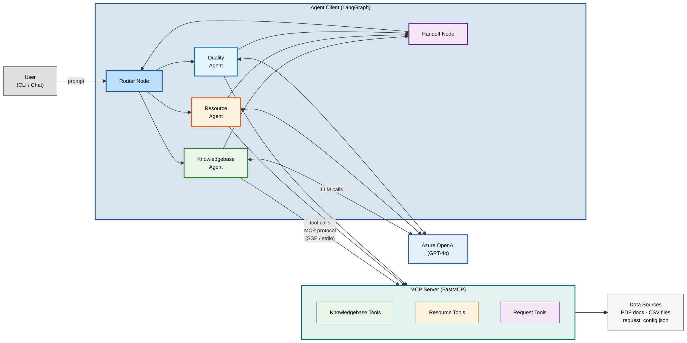
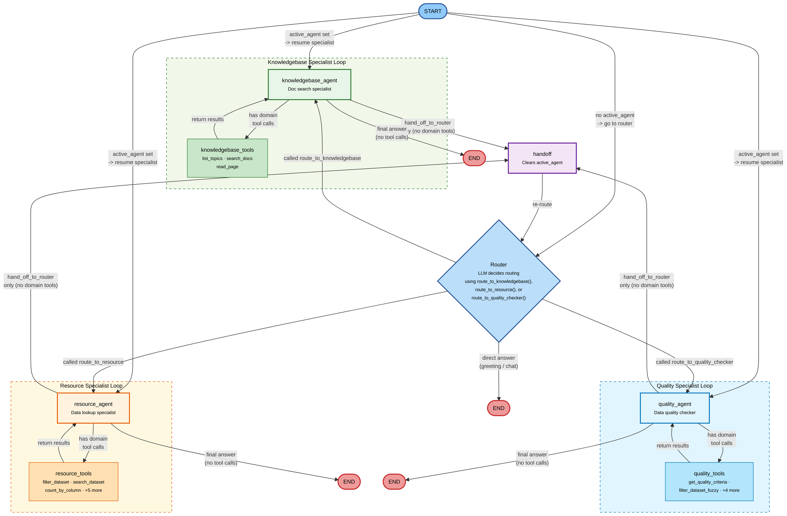
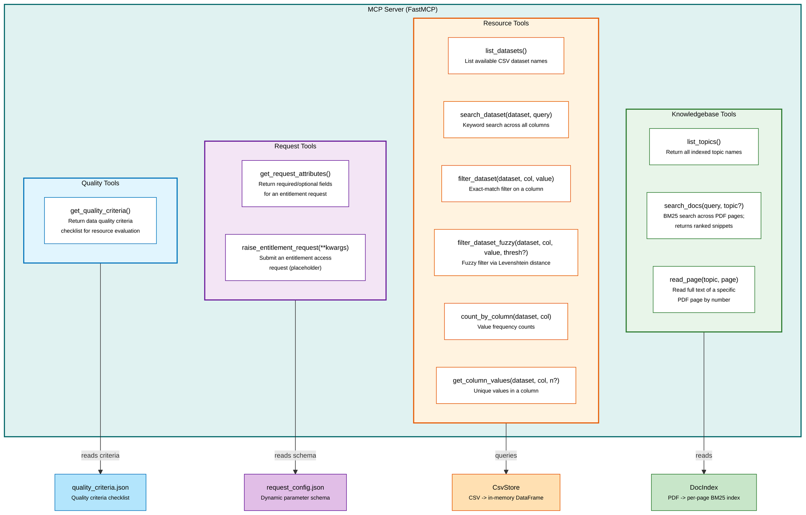
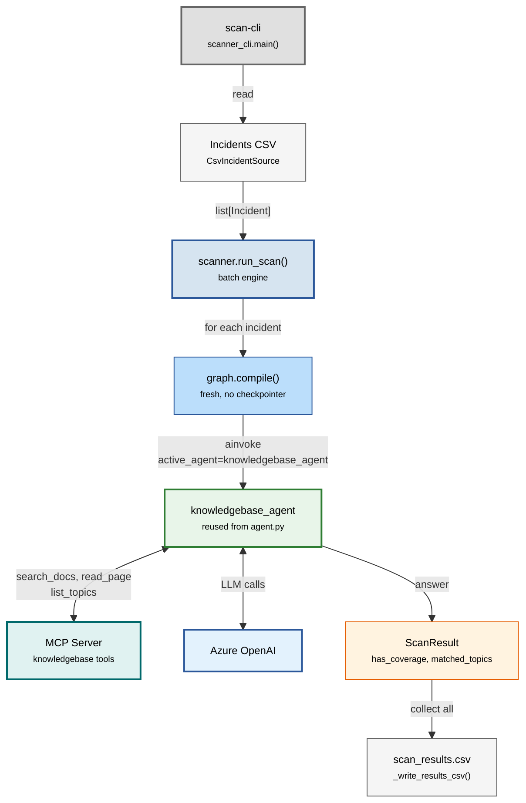

# Access Governance AI — Architecture

## 1. High-Level Overview

The system consists of two main components communicating over the
[Model Context Protocol (MCP)](https://modelcontextprotocol.io/):
an **Agent Client** (LangGraph) that orchestrates multi-turn conversations,
and an **MCP Server** (FastMCP) that exposes documentation, data, and
request tools.

---

## 2. LangGraph Agent Graph

The agent is built as a **LangGraph StateGraph** with 8 nodes and
conditional edges that route based on LLM tool-call decisions.
State tracks `messages[]` and `active_agent` (persistent specialist
ownership across turns).

### Conditional Edge Summary

| Edge function | From | Condition | Routes to |
|---|---|---|---|
| `route_entry()` | START | `active_agent` is set | Resume that specialist directly |
| | | `active_agent` is empty | Router |
| `route_from_router()` | Router | Called `route_to_knowledgebase` | knowledgebase_agent |
| | | Called `route_to_resource` | resource_agent |
| | | Called `route_to_quality_checker` | quality_agent |
| | | No tool call (direct answer) | END |
| `specialist_edge()` | Specialist | Has domain tool calls | Specialist's tool node |
| | | `hand_off_to_router` only | Handoff |
| | | No tool calls (final answer) | END |

---

## 3. MCP Server — Tool Architecture

The MCP server exposes **12 tools** organized into four groups.
Tools are discovered dynamically by the agent client at startup via the
MCP protocol.

### Tool Bindings per Agent Node

| Agent Node | Bound Tools | Notes |
|---|---|---|
| **Router** | `route_to_knowledgebase(reason)`, `route_to_resource(reason)`, `route_to_quality_checker(reason)` | Internal routing tools (not MCP). Can also answer directly. |
| **knowledgebase_agent** | `list_topics`, `search_docs`, `read_page`, `hand_off_to_router` | MCP tools + handoff |
| **resource_agent** | `list_datasets`, `search_dataset`, `filter_dataset`, `filter_dataset_fuzzy`, `count_by_column`, `get_column_values`, `get_request_attributes`, `raise_entitlement_request`, `hand_off_to_router` | MCP tools + handoff |
| **quality_agent** | `get_quality_criteria`, `filter_dataset`, `filter_dataset_fuzzy`, `search_dataset`, `list_datasets`, `get_column_values`, `hand_off_to_router` | MCP tools (shared resource tools + quality tool) + handoff |
| **handoff** | *(none -- processes pending `hand_off_to_router` calls)* | Clears `active_agent` and returns to Router |

---

## 4. Incident Scanner -- Batch Flow

The scanner CLI (`scan-cli`) is a standalone batch tool that reuses the
existing agent graph without modification. It reads incidents from a CSV,
runs each through the knowledgebase agent, and writes a coverage report.

Key points:
- **No router involved** -- `active_agent="knowledgebase_agent"` bypasses routing
- **Fresh graph per incident** -- no shared conversation state between incidents
- **Reuses agent.py** -- imports `build_graph` and `_get_mcp_server_config` directly
- **Coverage heuristic** -- parses citations from the agent response to detect gaps
